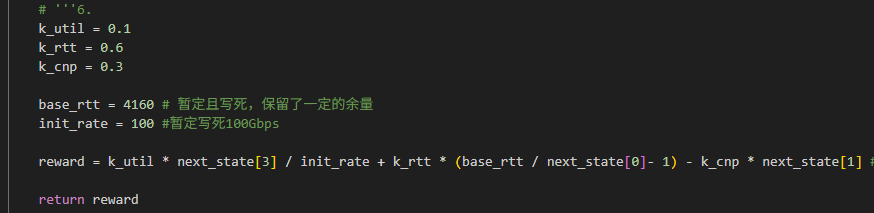

本文件夹用于保存训完的模型，以防丢失
model_longflows.pth:
    - 奖励函数：
        
    - 节点2使用aicc，其他节点使用timely
    - 训练flow：
8
2  1 3 100 200000000 2
3  1 3 100 20000000 2.001
4  1 3 100 20000000 2.001
5  1 3 100 20000000 2.001
6  1 3 100 20000000 2.001
7  1 3 100 20000000 2.001
8  1 3 100 20000000 2.001
9  1 3 100 20000000 2.001